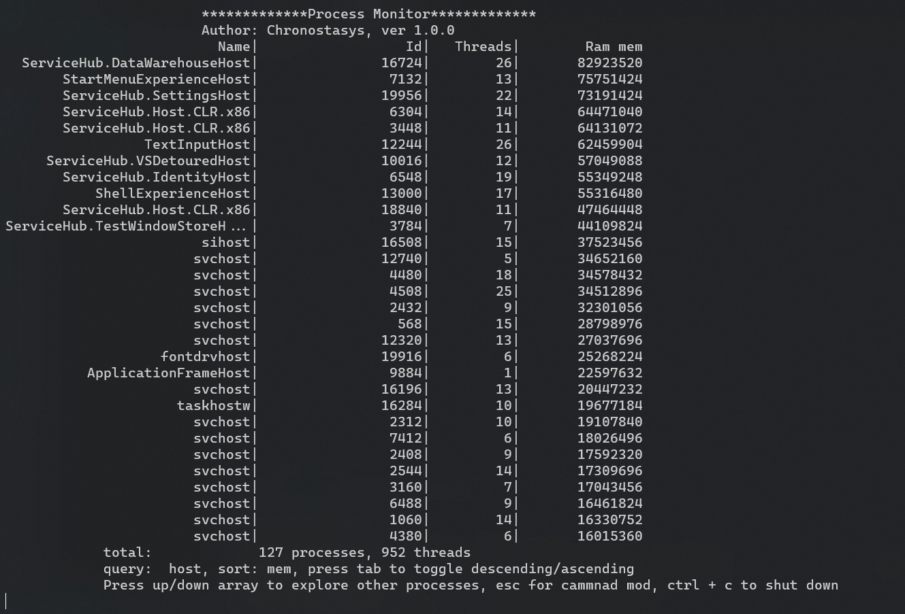

# Process Monitor

A light weight, cross platform, console based process monitor which support basic search & sort.

## Commands

- find <name>:
  find processes by name
- sort <prop>:
  prop is name|id|thread|mem
- kill <id>
  id is process id
